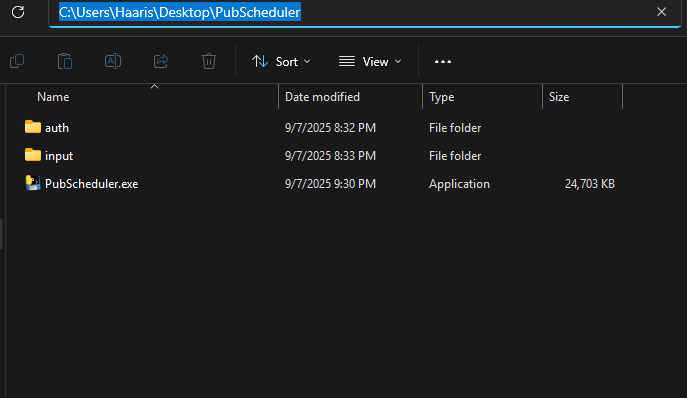
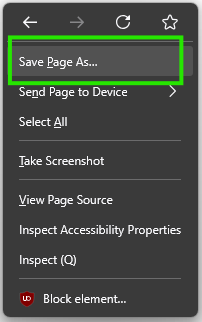

# Publix PASSport Google Calendar™ Integration
## by Haaris Khalique

**Note: This program was written with Python 3.12.3 To ensure compatibility when building from source, make sure to have Python 3.12 installed in your environment.**
___
For a while, I wished for a way to take my shift data from Publix PASSport and upload it to my digital calendar. The only options available to me were screenshotting my schedules or manually creating events in my digital calendar, the latter of which could take up to a minute.

In Summer 2024, I decided to take the task on myself and wrote the first version of this program using Python. It automated the login process, downloaded and processed the HTML of the schedule page from PASSport, and creates events in Google Calendar. The web automation worked using Selenium, but the overall workflow was still a bit slower than I desired and handling 2FA got in the way of headless operation.

During development, the schedule page on PASSport was redesigned. I decided it was quicker and more secure for users to login to PASSport themselves, save the HTML pages for each schedule week they needed to upload, then pass it directly to the program for processing. This method worked well and I have been using it every week for a full year, from 9/2024 to 9/2025. The same process that used to take 1-2 minutes and repeated gestures on my phone screen now took only seconds and a few clicks of my mouse. However, I designed it to only process one file on each run and it required users to type in the file name in a terminal. What if I needed to upload two weeks worth of schedules? Or three? Or every single one since my original hire date?

This new version drops the need for users to interact with the program in a terminal and can handle more than one file at a time. The program looks for any HTML files with the appropriate folder in the project directory, processing each one and uploading the data to Google Calendar. Finally, it deletes the files, so that you have a clean slate for the next run and avoid duplicate entries. The program is now a one-shot operation and requires no input during execution. The only work demanded from the user is the acquisition of the desired HTML page(s) from the schedule section on PASSport.

# Setup
###  Create project folder
Create a folder somewhere accessible to store the program files. Within this folder, create one folder called **auth** and another folder called **input**.
- **/auth** will store the files necessary for authorizing the program to create events in your Google calendar.
- **/input** will store any schedule data (HTML files) you wish to pass to the program to upload to your Google calendar.

### Set up Google Cloud environment
To call the Google Calendar API, you will need credentials authorizing the program to access the requested service. **See the [Google Calendar API quickstart documentation](https://developers.google.com/calendar/api/quickstart/python#set-up-environment) and refer to the "Set up your environment" through "Authorize credentials for a desktop application" sections to guide you** in acquiring the credentials.json file. The credentials file is used to authorize a desktop application to access Google services. 

- Save **credentials.json** to the **/auth** folder.

*In order to ensure zero relationship between user data and myself, this task of creating a Google Cloud project environment along with application credentials was given to the users. The program operates locally on your machine and only exchanges data between your machine and Google services for calendar access.*

### Download the program
##### Executable - Windows 11 only
- Install the latest release from the project repository and save it directly to the project folder you created. It should exist alongside **/auth** and **/input**.

___

# Usage

#### 1. Log in to Publix PASSport and access the schedule week you wish to add to your calendar.

#### 2. Download the HTML page for each desired week and save to /input in your project folder:

 *You can rename the file if you wish, it has no effect. Just maintain the file extension of .htm or .html*

#### 3. Run the program.
##### Executable
- Open your project folder and double-click **PubScheduler.exe**

#### 4. Authorize the program to view, modify, and create events

Upon first access to your Google Calendar (when no token.json is present), a browser will open and you will be asked to authenticate the program to edit your calendar. Verify that the program named is the same Google Cloud project you created your credentials.json from and authorize the program to modify your calendars.

A **token.json** file will be created in **/input** which will allow you to skip the trust/authorize step in the future. **KEEP THIS FILE SECURE** as it is your personal access token to your calendar. 

- **Docker users:** Handling inital token generation from a container has been a challenge during development so far. For this reason, you must run the program once locally (either from source or the executable) to generate the token. Then, you can copy the token to the folder you've binded to the container so that it can use it.

The program continues from here. The HTML will be processed for schedule information and events will be created in your Google Calendar within seconds!

The schedule files are then removed, leaving a clean slate for the next run, and the program closes.

___
## Developer's Note
This program was developed as a personal side project to explore Python, Docker, data scraping, and leveraging an existing API to create a feature that I have long desired. I intend to continue refining and updating the project as it is still a WIP.

While I am employed by Publix, this project was not developed as part of my role there, nor is it endorsed by or affiliated with Publix in any official capacity. This project is for personal and educational purposes only, and no profit is being made from it.

Google Calendar is a trademark of Google Inc. Use of this trademark is subject to Google Permissions.